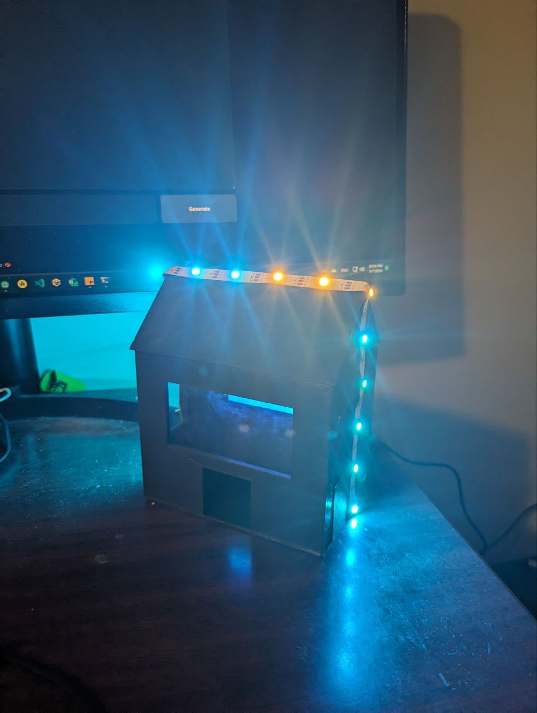

# SmartHomeCircuitPython

SmartHomeCircuitPython is an innovative project developed by our team to bring the dynamics of global weather right into your living room. By simulating any city's weather and atmospheric conditions, this project aims to deliver a unique and immersive experience that keeps you connected with the world outside, all from the comfort of your home.

## Key Features

- **Weather Simulation**: Leveraging the OpenWeather API, SmartHomeCircuitPython can simulate a vast array of weather conditions from different cities around the globe. Whether it's the tranquil breeze of Bali or the harsh winter of Chicago, experience it all without stepping outside.

- **Interactive Interface**: Integration with the Telegram Bot API provides a user-friendly and interactive command center. Control and customize your weather experience with simple text commands.

- **Advanced Weather Scenarios**: From thunderstorms to severe weather warnings, SmartHomeCircuitPython doesn't shy away from showcasing the full spectrum of what Mother Nature has to offer. Be prepared to rethink your outdoor plans as you witness the power of simulated weather.

- **Homey Touches**: To make your experience even more delightful, we've integrated a Dad's Joke API, ensuring that your simulated environment feels as warm and inviting as your actual home. Coupled with a conceptual TV display, it offers a comprehensive and engaging indoor experience.

## Getting Started

To get started with SmartHomeCircuitPython, follow these simple steps:

1. **Setup Your Device**: Simply plug your device into a power source, whether it's a USB port on your laptop or a USB-compatible battery pack. The device will automatically search for and connect to the pre-configured home Wi-Fi network specified in the `settings.toml` file. Before proceeding, ensure that you have updated the BSSID and password to match your home network settings.

    **Tested Environment**:
    - **Device**: Raspberry Pi Pico W
    - **Microcontroller**: RP2040
    - **CircuitPython Version**: Adafruit CircuitPython 8.2.9 (Released 2023-12-06)
    - **Board ID**: raspberry_pi_pico_w

    This information is crucial to understand the hardware context in which SmartHomeCircuitPython was developed and tested.

2. **Install Dependencies**: Download and install the necessary libraries and dependencies as detailed on the project's GitHub repository, including the Telegram Bot API and OpenWeather API clients.

3. **Configure Your Environment**: Use the `display.py` and `neo.py` scripts to enable functions like marquee for text display and weather simulation visuals. These functions enrich the user experience by providing dynamic feedback and interactive elements.

4. **Deploy the Application**: Load the `code.py` onto your device, integrating all components for full functionality. Adjust your settings to simulate your chosen city's weather conditions.

5. **Enjoy**: Engage with the atmospheric simulations, exploring varied weather phenomena from across the globe.

## Build Setup

**Telegram Bot Interface**

**Assembling 3D-Printed Build**

**Clear Sky Simulation**

## Support

Should you encounter any issues or have any questions, please feel free to reach out to our support team. We are dedicated to providing assistance and ensuring your experience with SmartHomeCircuitPython is nothing short of fantastic.

## License

SmartHomeCircuitPython is released under the MIT license. For more information, please refer to the LICENSE file in the repository.
